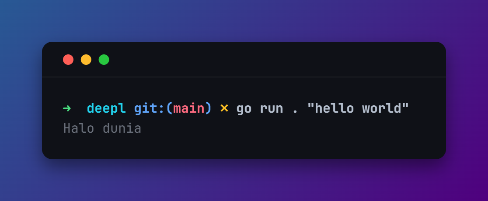

# DeepL SRT Translator (Go)

Translate text and `.srt` subtitle files to Indonesian through DeepL's web endpoint — no API key, no external dependencies.



## Repository name

```
deepl-srt-translator
```

Alternatives: `go-deepl-translate`, `deepl-web-translator`, `srt-deepl-id`.

## Description

> Go CLI (standard library only) that translates text and `.srt` subtitle files to Indonesian over DeepL's web WebSocket. It starts a fresh session per request, slices text into chunks that fit the 1500-character limit, and preserves subtitle line structure.

Short version for GitHub *About*:

> Translate text and .srt subtitle files to Indonesian via DeepL's web endpoint. No API key, no dependencies.

## Tags

```
golang
go
deepl
translator
translation
srt
subtitle
websocket
protobuf
msgpack
cli
no-api-key
bahasa-indonesia
```

## Usage

```bash
go run . "hello world"                 # Halo dunia
go run . subtitle.srt > subtitle.id.srt
./translate.sh subtitle.srt            # writes subtitle.id.srt
./translate.sh subtitle.srt out.srt    # explicit output path
```

Override the chunk budget (default 1400 characters, the server rejects anything above 1500):

```bash
DEEPL_MAX_CHARS=1200 ./translate.sh subtitle.srt
```

## How it works

The whole flow is three pieces: an HTTP call to open a session, a raw WebSocket to the translation service, and a small msgpack + protobuf codec on top.

### 1. Start a session

`deepl.StartSession` sends a protobuf `POST` to:

```
https://ita-free.www.deepl.com/v2/startSession?client=<client-id>
```

with headers `Content-Type: application/x-protobuf`, `Origin: https://www.deepl.com`, `Referer`, and `x-statsig-stable-id`. The protobuf body (`startBodyB64` in `internal/deepl/deepl.go`) is the payload the site itself sends; it carries the language list and features DeepL expects.

The response is a small protobuf. Field 5 holds the WebSocket path:

```
/v2/sessions?s=<session-uuid>&p=2&i=<token>
```

`StartSession` prepends `wss://ita-free.www.deepl.com` and appends `&client=<client-id>`. Because this happens on every request, the `s`/`i` token is always fresh — there is no static credential to manage. (Fields 1, 2 and 3 of the response are the session uuid and tokens we do not need to resend.)

### 2. Open the WebSocket

`internal/deepl` dials `ita-free.www.deepl.com:443` with `crypto/tls`, then writes the HTTP/1.1 upgrade by hand instead of using a WebSocket library. The reason is `Origin`: the upgrade request must contain `Origin: https://www.deepl.com` and the browser `User-Agent`, and a hand-rolled client makes that explicit.

```
GET <path>?<query> HTTP/1.1
Host: ita-free.www.deepl.com
Upgrade: websocket
Connection: Upgrade
Sec-WebSocket-Key: <random>
Sec-WebSocket-Version: 13
Origin: https://www.deepl.com
User-Agent: <browser UA>
```

The client validates the `101` response, then speaks the WebSocket framing directly: client frames are masked, ping frames are answered with pong, continuation frames are reassembled.

### 3. Message sequence

After the socket is open:

| # | Direction | Message | Meaning |
|---|-----------|---------|---------|
| 1 | client → server | text `{"protocol":"messagepack","version":1}` + `\x1e` | protocol announcement |
| 2 | server → client | binary `{}` + `\x1e` | greeting, sent after #1 |
| 3 | client → server | `[6]` | ack |
| 4 | client → server | `[1, {}, <pid>, "Participate", [ext3 ""]]` | join the session |
| 5 | server → client | `[3, {}, <pid>, 3, nil]` | participate accepted |
| 6 | server → client | `[1, {}, nil, "AppendResponse", [ext5 ...], []]` | language list / ready |
| 7 | client → server | `[1, {}, <stream>, "AppendRequest", [ext4 <protobuf>]]` | the text to translate |
| 8 | client → server | `[3, {}, <stream>, 3, nil]` | ack for stream |
| 9 | server → client | `[1, {}, nil, "AppendResponse", [ext5 <protobuf>], []]` | translation |

Steps 3–7 are triggered by state, not by a fixed delay: the client replies to the greeting with `[6]` + `Participate`, and sends the `AppendRequest` as soon as the participate ack arrives (with a 2 s fallback timer in case the ack never comes). `<pid>` and `<stream>` are unique per run so a cached socket cannot collide with a previous translation.

The client keeps reading frames until 800 ms pass with no new translation, then returns the last translated text. A 3-minute read deadline covers the whole exchange.

### 4. Wire format

Every binary frame payload is **length-prefixed**:

```
varint(len(payload)) + payload   # payload is one or more msgpack values
```

The leading varint is a *byte length*, not a sequence number. This matters: sending it as a hardcoded value only works when the encoded text happens to be that exact length, and the server otherwise answers `Failed to invoke 'AppendRequest' due to an error on the server.` `msgpack.Frame` strips the varint, and `deepl` computes it with `protobuf.Varint(len(payload))`.

`internal/msgpack` implements just enough msgpack: fixints, `uint`/`int` widths, `fixstr`/`str8`/`str16`/`str32`, arrays, maps, and ext types.

### 5. AppendRequest payload

The `ext4` blob (`protobuf.BuildAppendRequest`) is a protobuf:

```proto
message AppendRequest {
  message Body {
    message Text { // field 2
      Empty  at   = 1;   // always empty
      string text = 2;   // the text to translate
    }
    uint64 doc    = 1;   // document id, must be 1
    Text   text   = 2;
    Config config = 6;   // { 1: 2 }
  }
  Body   body   = 1;
  Target target = 2;     // { 1: { 1: 22 } }  -> 22 = Indonesian
}
```

`doc` must stay `1`; any other value makes the server stop responding. The target language code `22` (Indonesian) is hardcoded in `BuildAppendRequest`.

### 6. Reading the translation

The `ext5` blob is walked without a schema. `protobuf.ExtractTranslation` descends the repeated path

```
field 3  →  field 1  →  field 2  →  field 2 (string)
```

and collects every non-UUID string it finds, joined by a space. Sentences, line breaks, and paragraph breaks arrive intact, which is what makes the SRT pipeline possible.

### 7. SRT pipeline

`main.go` + `internal/srt`:

```
Parse        .srt        -> []Cue{Index, Time, Lines}
Lines        []Cue       -> flat []string (one entry per text line) + positions
Chunks       flat lines  -> groups whose joined length <= 1400 characters
for each chunk:
    Translate(join(chunk, "\n"))     # one fresh session per chunk
    split result on "\n"
    if line count != input line count:
        split the chunk in half and translate each half again  (recursive)
Put          results     -> back into the cues at their original positions
Render       []Cue       -> .srt text on stdout
```

Index and timestamp lines are never sent to the translator — only the text lines. Because the server returns one output line per input line, mapping back to cues is exact; the recursive split only kicks in when that assumption breaks.

## Project layout

```
main.go              CLI: plain text or .srt file
translate.sh         wrapper: ./translate.sh <file.srt> [output.srt]
internal/deepl/      startSession, raw WebSocket, translation flow
internal/msgpack/    msgpack encode/decode + length-prefixed framing
internal/protobuf/   BuildAppendRequest, ExtractTranslation, generic field walk
internal/srt/        parse/render .srt, chunking
```

## Notes and limits

- The server answers with the **whole document**, and **one session equals one document**: reusing a session for a different text returns the old translation prepended to the new one. Every chunk therefore takes a fresh session.
- Hard server limit: **1500 characters per request**. Larger requests close the socket with `EOF` — not `1500 words`.
- Line breaks (`\n`) are preserved 1:1 by the server, which is what allows per-line re-mapping.
- The target language is hardcoded to Indonesian (`0x16 = 22`) in `AppendRequest`.
- DeepL's web endpoint can change at any time; if the protocol shifts, `internal/deepl` is the place to adjust.
